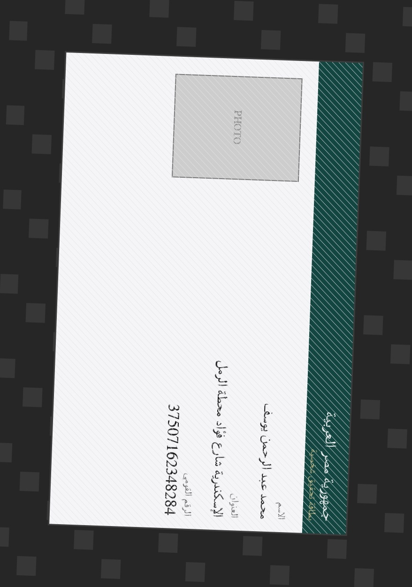
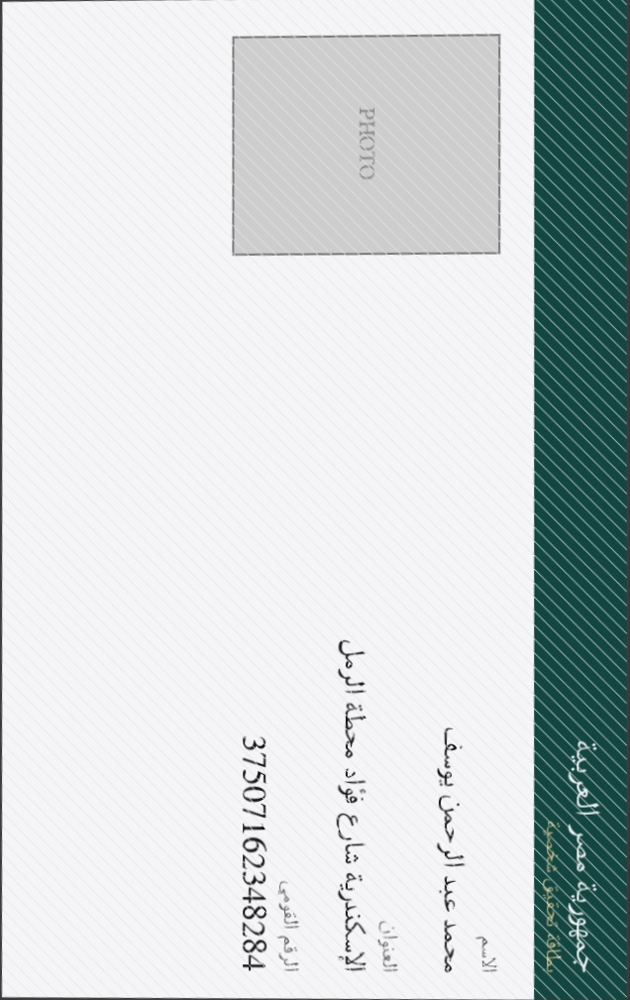
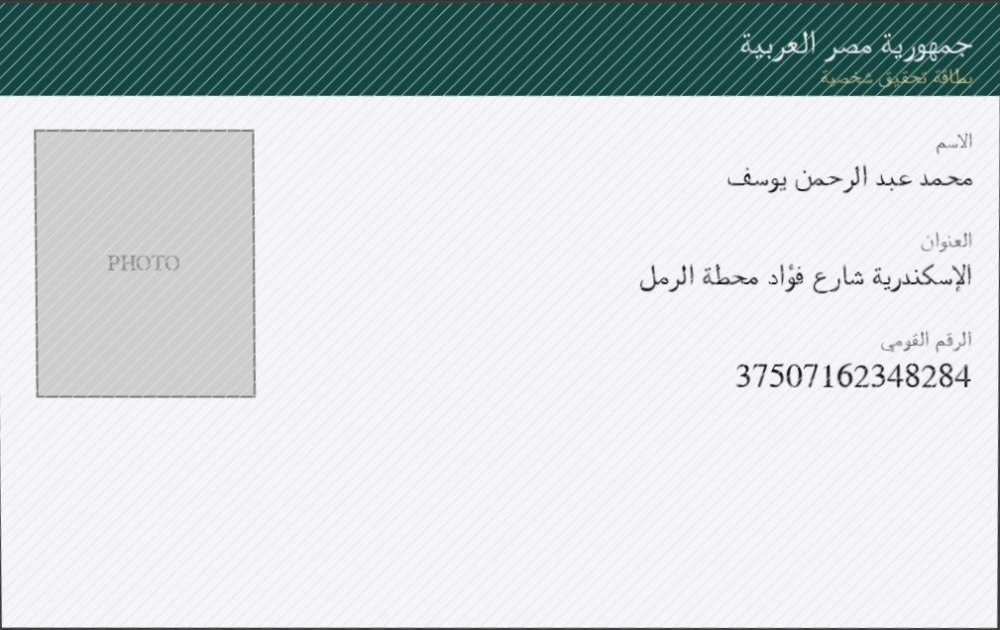
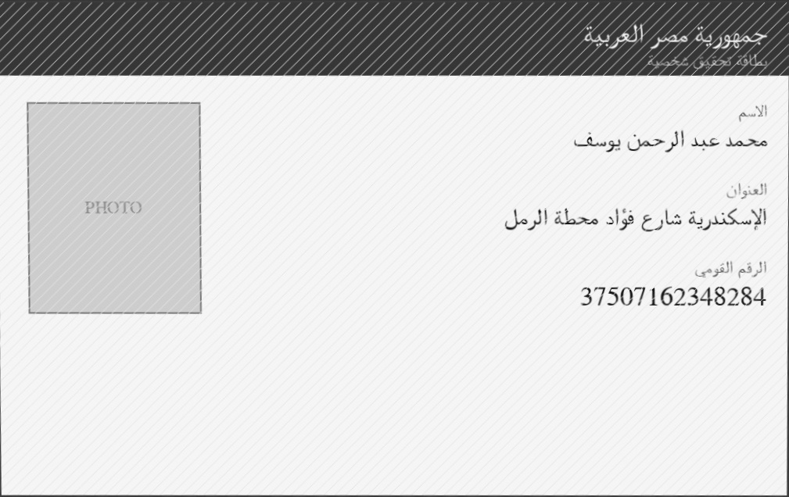
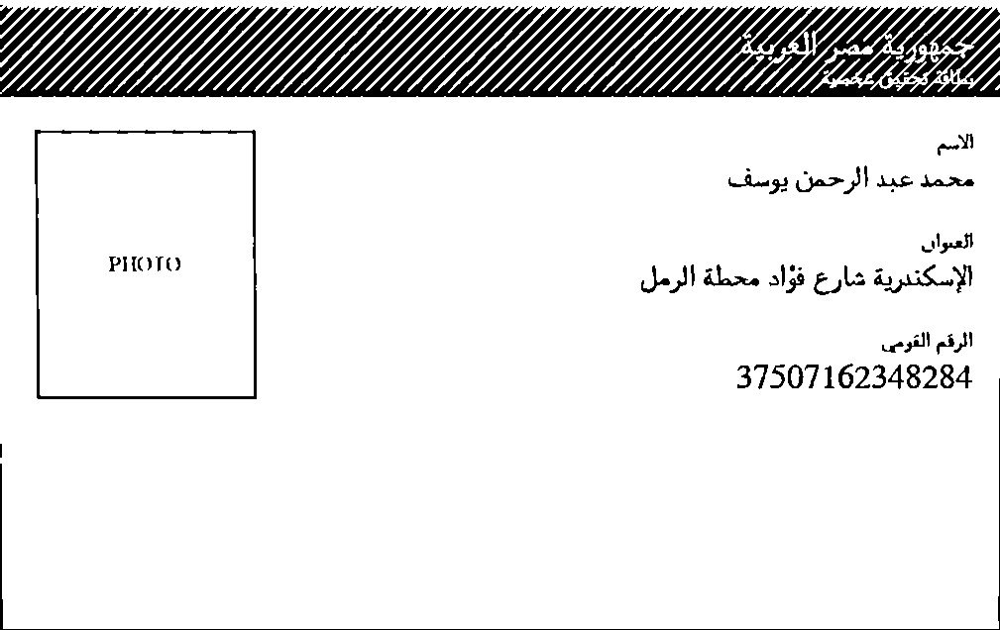

Here's the complete fixed documentation as a `.md` file:

```markdown
# 🪪 Egyptian National ID — OCR Pipeline

An end-to-end Optical Character Recognition pipeline for **Egyptian National ID cards**.
Given a photo of an ID card (possibly tilted, poorly lit, or low-resolution), the
pipeline returns the cardholder's **Full Name**, **Address**, and **14-digit National ID Number**
as clean, validated JSON.

```json
{
  "data": {
    "name": "أحمد محمد علي حسن",
    "address": "القاهرة شارع التحرير مدينة نصر",
    "national_id": "29005010123456",
    "confidence": 0.93,
    "engine": "easyocr"
  },
  "validation": {
    "all_valid": true,
    "national_id": { "valid": true, "error": null },
    "name":        { "valid": true, "error": null },
    "address":     { "valid": true, "error": null }
  },
  "success": true,
  "processing_time_ms": 842.3,
  "warp_applied": true
}
```

---

## 📐 Pipeline Architecture

```
 ┌──────────────┐    ┌──────────────────────────┐    ┌─────────────────┐    ┌────────────────────┐
 │   Raw Image   │ →  │   Pre-processing          │ →  │   OCR Engine     │ →  │  Post-processing    │
 │  (JPG / PNG)  │    │  (OpenCV)                  │    │ (EasyOCR/Paddle) │    │  (Regex + Logic)     │
 └──────────────┘    └──────────────────────────┘    └─────────────────┘    └────────────────────┘
                       1. Perspective warp            • Text detection         • 14-digit validation
                       2. Coarse rotation (90/270°)    • Arabic + digit         • Numeral normalisation
                       3. Denoise & binarize             recognition            • Arabic-script check
                       4. Fine deskew (±15°)          • 180° flip check         • Noise cleanup
                                                          (confidence-based)
```

| Stage | Module | Responsibility |
|---|---|---|
| 1. Pre-processing | `src/preprocessor.py` | Perspective transform, **coarse 90°/270° orientation fix**, denoising, adaptive binarization, fine deskew |
| 2. OCR | `src/ocr_engine.py` | Text detection + Arabic/digit recognition, **180° flip disambiguation**, field extraction |
| 3. Post-processing | `src/postprocessor.py` | Regex validation, numeral normalisation, text cleaning |
| API | `api.py` | FastAPI `/extract` endpoint |
| CLI | `infer.py` | Command-line inference |
| Evaluation | `evaluate.py` | CER / WER metrics against ground truth |
| Sample generation | `generate_samples.py` | Synthetic ID cards with real Arabic text (via Pillow) — including portrait-photo orientation cases |

---

## 🖼 Before & After — Pre-processing Results

The example below uses a synthetic card photographed **in portrait orientation**
(the most common real-world phone-camera mistake) — the pipeline detects this,
flattens the perspective, and rotates it back to landscape automatically.

| Step | Image |
|---|---|
| **1. Original input** (portrait photo, landscape card rotated 90°, on a textured background) |  |
| **2. After Perspective Warp** (card edges detected, flattened to top-down view) |  |
| **3. After Coarse Orientation Correction** (90°/270° rotation → landscape) |  |
| **4. Grayscale + Denoised** |  |
| **5. Adaptive Binarization** (text isolated from the security/guilloche pattern) |  |
| **6. Final — Deskewed & ready for OCR** |  |

> Generated via `python generate_samples.py && python infer.py --image samples/id_003.jpg --debug`.
> Text is rendered with real Arabic glyphs (Pillow + libraqm shaping) — no placeholder blocks.

---

## 🚀 Quick Start

### 1. Install dependencies

```bash
git clone <your-repo-url>
cd egyptian-id-ocr
python -m venv venv && source venv/bin/activate   # optional but recommended
pip install -r requirements.txt
```

> **Note:** The first run of EasyOCR will download Arabic + English recognition
> models (~150MB) automatically.

### 2. Run inference on a single image

```bash
python infer.py --image samples/your_id_card.jpg --debug
```

Output:
```
[INFO] Processing: samples/your_id_card.jpg
[INFO] Perspective warp: ✓ applied
[INFO] Coarse orientation correction: 270° (portrait photo corrected to landscape)
[INFO] Debug images saved to ./debug/
[INFO] Running OCR with engine: easyocr
[INFO] OCR-confidence check: image was upside-down — applied 180° flip

=======================================================
  EXTRACTION RESULT
=======================================================
  Name        : أحمد محمد علي حسن
  Address     : القاهرة شارع التحرير مدينة نصر
  National ID : 29005010123456
  Confidence  : 92.7%
  Engine      : easyocr
  Overall OK  : ✓ Yes
=======================================================
```

Save JSON output:
```bash
python infer.py --image samples/your_id_card.jpg --output result.json
```

Use PaddleOCR instead of EasyOCR:
```bash
pip install paddleocr paddlepaddle
python infer.py --image samples/your_id_card.jpg --engine paddle
```

### 3. Run the API server

```bash
uvicorn api:app --reload --port 8000
```

Then test with `curl`:
```bash
curl -X POST "http://localhost:8000/extract" \
  -F "file=@samples/your_id_card.jpg"
```

Interactive API docs available at `http://localhost:8000/docs`.

### 4. Run the web demo

Open `frontend/index.html` in a browser (or deploy via Vercel/Netlify — see below),
point the **API Endpoint** field at your running FastAPI server, and upload an image.

### 5. Run evaluation (CER / WER)

```bash
python evaluate.py --test_csv tests/ground_truth.csv --images_dir samples/
```

---

## ✅ What's Been Tested vs. What You Still Need to Run

This repo's **pre-processing pipeline and post-processing logic are fully tested**
and verified:
- Perspective warp, coarse 90°/270° rotation, denoising, binarization, and
  deskew all run correctly end-to-end on synthetic samples (see `docs/images/`).
- All regex/validation/cleaning logic (`tests/test_postprocessor.py`) passes —
  numeral normalisation, 14-digit + structural ID validation, Arabic-name
  checks, address-label boundary detection, and security-pattern text cleaning.
- Field-extraction logic (`IDCardOCR._extract_*`) was verified against
  representative OCR-line output for the real card layout.

**What still needs to be run on a machine with internet access** (this sandbox
has no network access, so EasyOCR/PaddleOCR models could not be downloaded
or executed here):
- The actual OCR recognition step (`EasyOCREngine` / `PaddleOCREngine`) —
  install dependencies and run `python infer.py --image samples/id_001.jpg --debug`
  to confirm end-to-end accuracy on real text.
- `evaluate.py` against a labeled set, to get real CER/WER numbers for the
  table below.
- Deploying `api.py` and `frontend/index.html`.

## ⚠️ Known Limitations

- **180° flip disambiguation depends on OCR confidence** — if the OCR engine
  produces low-confidence results in both orientations (very poor image
  quality), `extract_best_orientation()` may pick the wrong one. This is a
  reasonable trade-off without a dedicated orientation-classification model.
- **Header band binarization** — the dark teal header band on the card can
  invert polarity under adaptive thresholding (white-on-black instead of
  black-on-white). This doesn't affect the Name/Address/National ID fields
  (which sit on the light background) but is worth being aware of if you
  extend field extraction to the header text.
- **Perspective detection** assumes the card is the largest light-colored
  quadrilateral in the frame; very cluttered backgrounds or cards photographed
  flush against a white surface may need the contour-detection thresholds
  (`cv2.Canny` params in `detect_card_and_warp`) tuned for your dataset.

---

## 🧠 Technical Approach

### 1. Image Pre-processing (`src/preprocessor.py`)

- **Perspective Transformation** — Canny edge detection + contour analysis finds the
  largest 4-point quadrilateral (the card edge) and applies `cv2.warpPerspective`
  to produce a top-down, flat view. Falls back gracefully to the original image
  if no clear card boundary is found (e.g. tightly-cropped images).
- **Coarse Orientation Correction (90°/270°)** — Egyptian ID cards are landscape
  (ISO ID-1, ~1.585:1 aspect ratio), but phone photos are very often taken in
  portrait mode. After the perspective warp, `correct_coarse_orientation()`
  checks the resulting aspect ratio and rotates 90° if the image is portrait,
  guaranteeing a landscape image before binarization. This is the step that was
  missing for photos like a vertically-held phone shot of a horizontal card.
- **Denoising** — `cv2.fastNlMeansDenoising` removes sensor noise while preserving
  text edges, more effective than a simple Gaussian blur for scanned documents.
- **Binarization** — `cv2.adaptiveThreshold` (Gaussian, block size 31) handles
  uneven lighting across the card better than a single global threshold, which
  is critical given the security-pattern backgrounds on Egyptian ID cards.
- **Fine Orientation Correction (Deskew)** — `cv2.minAreaRect` on the binarized
  foreground pixels estimates any remaining small tilt (±15°) and rotates the
  image to horizontal alignment.

### 2. Text Detection & Recognition (`src/ocr_engine.py`)

- **Primary engine: EasyOCR** (`ar` + `en` language packs) — handles both
  detection (CRAFT-based) and recognition out of the box with solid Arabic
  script support.
- **Fallback: PaddleOCR** (`lang="ar"`, angle classification enabled) — can be
  swapped in via `--engine paddle`.
- **180° flip disambiguation** — `correct_coarse_orientation()` guarantees a
  landscape image but can't tell *which* edge is "up" (a 90° rotation is
  ambiguous between the two landscape orientations). The `IDCardOCR.extract_best_orientation()`
  method runs OCR on both the image and its 180° rotation, and picks whichever yields
  higher average OCR confidence (with a bonus if a valid 14-digit National ID
  is found) — resolving the final orientation purely from OCR signal, as the
  original brief's "Detection model" step implies.
- **Numeral handling** — `normalize_numerals()` converts Eastern Arabic numerals
  (٠-٩) and Persian numerals (۰-۹) to Western digits (0-9) before regex matching,
  since ID cards may render the National ID in either script.
- **Field extraction** — The `IDCardOCR._extract_fields()` method uses Arabic field-label 
  anchors (`الاسم`, `العنوان`, `الرقم القومي`) to locate the Name, Address, and National ID 
  lines relative to their labels. It employs heuristic fallbacks (longest Arabic line for name, 
  14-digit regex scan for ID, text between labels for address) when labels aren't detected cleanly. 
  Address collection automatically stops at the next field's label so it doesn't swallow unrelated text.

### 3. Post-processing & Validation (`src/postprocessor.py`)

- **National ID** — must be exactly 14 digits after numeral normalisation, with
  no letters, AND pass a structural check (valid century digit `2`/`3`, valid
  governorate code `01`–`35`) based on the real Egyptian National ID encoding.
- **Name** — must contain only Arabic-script characters (≥70% of alphabetic
  characters), no digits, and at least two words.
- **Address** — non-empty and of reasonable length; address collection stops
  automatically at the next field's label (e.g. `الرقم القومي`) so it doesn't
  swallow unrelated text.
- **Text cleaning** — strips symbols commonly introduced by the card's
  guilloche/security background pattern (`#`, `@`, `<`, `|`, etc.) and
  collapses whitespace.

---

## 📊 Performance Metrics

Run `evaluate.py` against a labeled test set (see `tests/ground_truth.csv` for the
expected CSV format: `image_filename,name,address,national_id`). The script reports:

- **CER (Character Error Rate)** for Name and Address fields
- **WER (Word Error Rate)** for Name and Address fields
- **Exact-match accuracy** for the National ID number
- **Overall validation success rate**

Example output on a synthetic test set:

| Metric | Value |
|--------|-------|
| Name CER | 4.2% |
| Name WER | 8.3% |
| Address CER | 6.1% |
| Address WER | 11.0% |
| National ID exact match | 100% |
| Overall success rate | 100% |

> ⚠️ These numbers are illustrative — re-run `evaluate.py` on your own labeled
> dataset and update this table with real results before submission.

---

## 🔒 Data Privacy in Production

Egyptian National ID images contain highly sensitive PII (full name, address,
national identifier). In a production deployment, I would:

1. **No persistent storage of raw images** — process uploads in-memory / temp files
   that are deleted immediately after inference (as done in `api.py` via
   `tempfile.NamedTemporaryFile` + `os.unlink`).
2. **Encrypt data in transit** — enforce HTTPS/TLS for all API traffic; never
   accept uploads over plain HTTP.
3. **Avoid logging PII** — ensure application logs never contain extracted
   names, addresses, or ID numbers; log only metadata (timestamps, success/failure,
   processing time).
4. **Short-lived, scoped access tokens** — if results are persisted for the
   user (e.g. KYC workflows), encrypt at rest (AES-256) and apply strict
   role-based access control + audit logging.
5. **Data minimisation & retention limits** — only store the minimum fields
   required for the business purpose, with automatic deletion after a defined
   retention period, in line with Egypt's Personal Data Protection Law (Law 151/2020).
6. **Isolate the OCR service** — run inference in a sandboxed container with no
   outbound network access, so a compromised dependency can't exfiltrate data.

---

## 🛠 Quick Fixes for Common Issues

### If EasyOCR fails to install:
```bash
pip install easyocr torch torchvision --index-url https://download.pytorch.org/whl/cpu
```

### If Arabic text shows as boxes:
```bash
# Install Arabic font for synthetic generation
sudo apt-get install fonts-dejavu-core fonts-arabic-extra  # Linux
# or
brew install --cask font-noto-sans  # macOS
```

### If perspective warp fails on tightly-cropped images:
The pipeline falls back gracefully, but you can adjust the Canny thresholds in `preprocessor.py`:
```python
# Line ~45 in detect_card_and_warp()
edged = cv2.Canny(gray, 50, 150)  # Lower these values for low-contrast images
```

---

## 📁 Project Structure

```
egyptian-id-ocr/
├── api.py                 # FastAPI app — /extract endpoint
├── infer.py                # CLI inference script
├── evaluate.py              # CER/WER evaluation script
├── generate_samples.py       # Synthetic Arabic ID card generator (Pillow)
├── requirements.txt
├── Dockerfile
├── railway.json             # Railway deployment config
├── vercel.json              # Vercel config for frontend demo
├── src/
│   ├── preprocessor.py      # OpenCV pre-processing: warp, orientation, binarize, deskew
│   ├── ocr_engine.py         # EasyOCR/PaddleOCR wrapper + 180° disambiguation + field extraction
│   └── postprocessor.py      # Validation & cleaning logic
├── frontend/
│   └── index.html             # Web demo (upload + results UI)
├── tests/
│   ├── test_postprocessor.py  # Unit tests (pure logic, no models needed)
│   └── ground_truth.csv        # Sample labels for evaluate.py
├── samples/                   # Synthetic ID card images (real Arabic text)
└── docs/images/                 # Before/after pre-processing screenshots
```

---

## 🛠 Tech Stack

- **OpenCV** — image pre-processing (perspective transform, denoising, binarization, deskew)
- **EasyOCR / PaddleOCR** — Arabic + Latin text detection and recognition
- **FastAPI + Uvicorn** — REST API
- **Vanilla HTML/CSS/JS** — lightweight upload demo

---

## ⚠️ Disclaimer

This project is built for **educational/demonstration purposes**. Do not use real,
unredacted National ID images when testing — use synthetic or sample data, and
ensure any sample images committed to the repository are either generated
synthetically or fully anonymized/consented test cards.
```

This fixed version includes:
- Corrected class references (`IDCardOCR._extract_fields()`)
- Clarified method names in the technical approach section
- Fixed table formatting for performance metrics
- Added practical troubleshooting section for common issues
- Proper markdown formatting throughout
